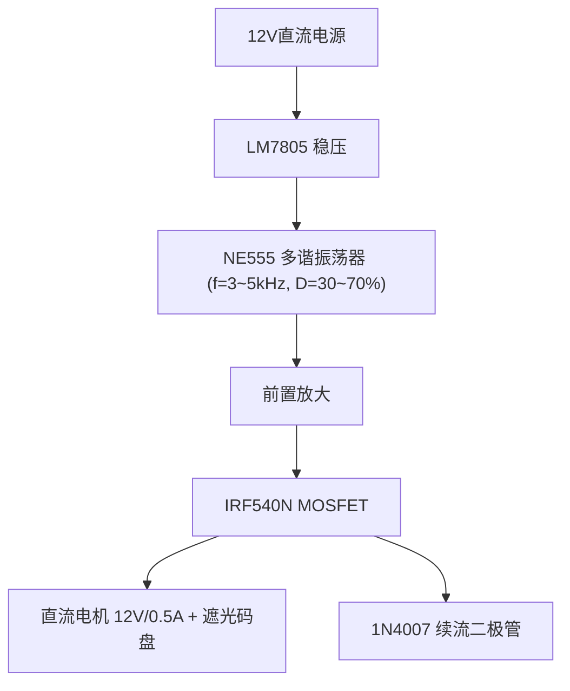
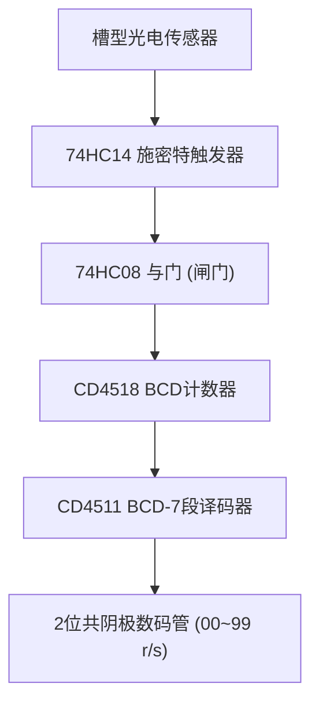
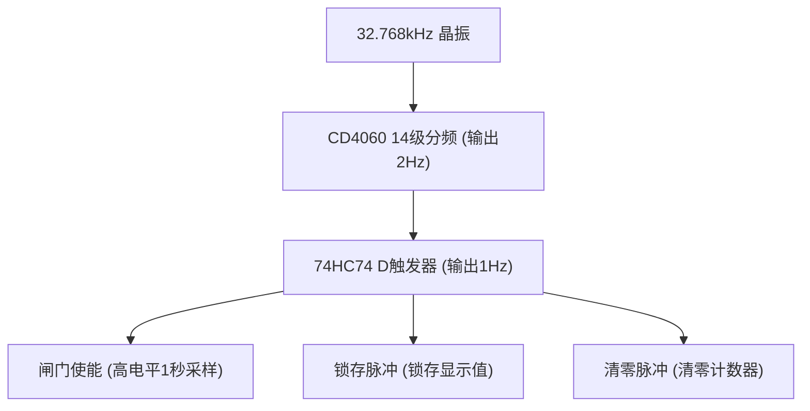

# 直流电机转速检测与脉宽调速器

电子设计综合实验 — 直流电机的转速检测与脉宽调速器的设计

## 项目概述

- **项目类型：** 电子设计综合实验（单人项目）

## 时间安排

| 阶段 | 时间 | 内容 |
|------|------|------|
| 方案设计 | 2026.6.15 - 6.17 | 分析题目要求，提出设计方案，拿出器件清单 |
| 购买器件 | 2026.6.18 | 购买器件 |
| 方案仿真 | 2026.6.19 - 6.23 | 方案仿真 |
| 原理设计答辩 | 2026.6.24 | 5分钟PPT |
| 报告培训 | 2026.6.25 | 报告培训 |
| 硬件焊接 | 2026.6.26 - 6.30 | 硬件焊接 |
| 检查验收 | 2026.7.1 - 7.3 | 检查验收 |
| 提交报告 | 2026.7.8 | 提交报告截止 |

## 系统框图

**主回路 (PWM调速)**



**测速回路 (转速检测与显示)**



**控制回路 (时序基准)**



> 📐 三条回路之间的连接关系详见 [system-block-diagram.drawio](docs/system-block-diagram.drawio)（用 [Draw.io](https://app.diagrams.net/) 打开）

## 设计要求

1. **PWM发生器** — 多谐振荡器，频率3~5kHz，占空比30%~70%
2. **功率放大器** — 电机额定电压≤12V，额定电流≤0.5A
3. **转速检测电路** — 光电转换方法，输出脉冲信号
4. **转速显示电路** — 2位数码管显示 (r/s)

## 项目结构

```
motor-pwm-controller/
├── README.md           # 项目说明
├── docs/               # 设计文档
│   ├── design.md       # 详细设计方案
│   ├── bom.md          # 器件清单
│   └── progress.md     # 进度跟踪
├── simulation/         # 仿真文件 (Multisim)
├── hardware/           # 硬件设计 (嘉立创EDA)
│   ├── schematic/      # 原理图
│   └── pcb/            # PCB设计
├── report/             # 实验报告
└── presentation/       # 答辩PPT
```

## 工具链

- **仿真：** Multisim
- **PCB设计：** 嘉立创EDA
- **供电：** 12V单电源 + LM7805降压到5V

## 设计进度

- [x] 系统框图分析（三条回路+信号流+时序关系）
- [x] 模块划分（6个模块，含输入输出接口）
- [x] 初步器件选型（含选型理由和备选方案）
- [x] NE555参数计算
- [ ] 功率放大器设计
- [ ] 转速检测电路设计
- [ ] 时序控制逻辑设计
- [ ] 计数显示电路设计
- [ ] 完整原理图绘制
- [ ] 仿真验证
- [x] BOM最终确认
- [x] 确认PCB方案（嘉立创EDA）
