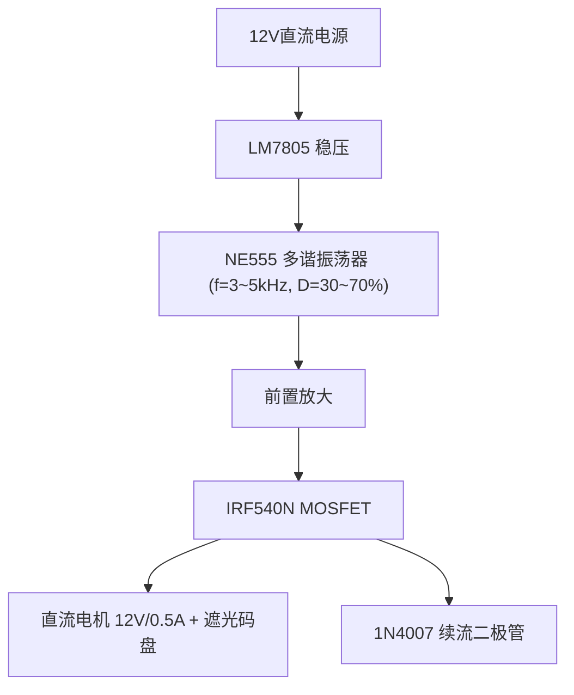
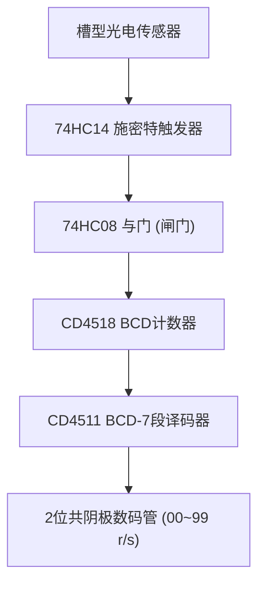
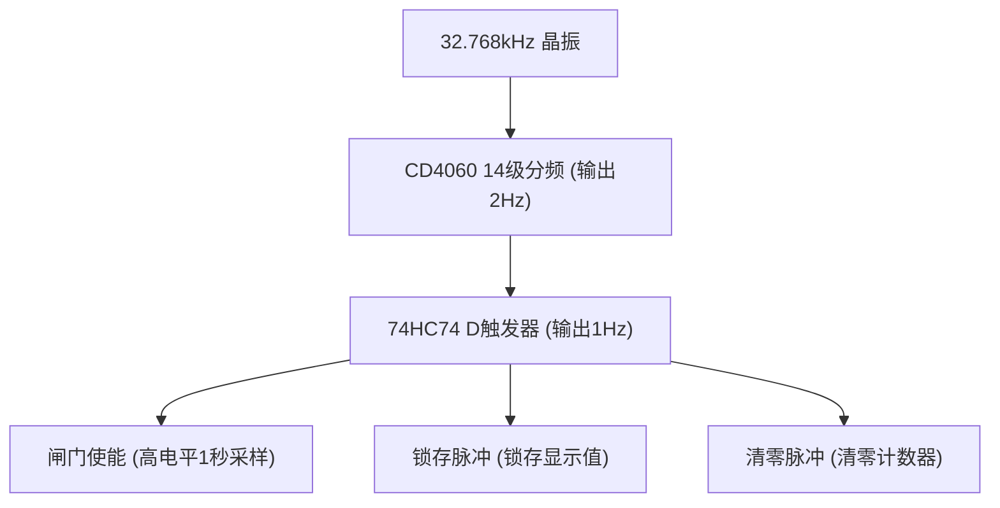

# 详细设计方案

## 一、系统框图分析

### 1.1 整体架构

系统由三条回路组成：**主回路（PWM调速）**、**测速回路（转速检测与显示）**、**控制回路（时序基准）**。

> 

**主回路 (PWM调速)**



**测速回路 (转速检测与显示)**



**控制回路 (时序基准)**



**时序关系 (每2秒一个周期)**


### 1.2 信号流分析

**主回路信号流：**
```
NE555 PWM输出 (3~5kHz方波, 占空比可调)
    │
    ▼
前置放大 (三极管或直接驱动)
    │
    ▼
IRF540N MOSFET 开关
    │
    ▼
直流电机 (12V/0.5A，转速随占空比变化)
    │
    ▼
遮光码盘 (产生脉冲，频率 ∝ 转速)
```

**测速回路信号流：**
```
光电传感器输出 (不规则脉冲, 幅度不稳定)
    │
    ▼
74HC14 施密特触发器 (整形为标准方波)
    │
    ▼
闸门 (与门控制, 1秒采样窗口)
    │
    ▼
CD4518 BCD计数器 (累计脉冲数 = 转速 r/s)
    │
    ▼
CD4511 译码器 ──→ 2位数码管显示
```

**控制回路信号流：**
```
32.768kHz 晶振
    │
    ▼
CD4060 14级分频 → Q14输出2Hz
    │
    ▼
74HC74 D触发器 二分频 → 1Hz方波 (T=1s)
    │
    ├──→ 闸门使能信号 (高电平1秒 = 采样窗口)
    ├──→ 采样结束后 → 锁存信号 (CD4511 LE)
    └──→ 锁存后 → 清零信号 (CD4518 CR)
```

### 1.3 时序关系

```
1Hz方波:    ┌──────┐        ┌──────┐
            │ 1s   │  1s    │      │
        ────┘      └────────┘      └────

闸门使能:   ┌──────┐
            │ 计数 │
        ────┘      └──────────────────

锁存信号:         ┌──┐
                  │  │  (采样结束后锁存)
        ──────────┘  └────────────────

清零信号:              ┌──┐
                       │  │  (锁存后清零)
        ───────────────┘  └───────────
```

**工作原理：** 每2秒一个完整周期——1秒开闸门计数，然后锁存显示值，再清零计数器，循环往复。

---

## 二、模块划分

### 模块1：PWM发生器 (多谐振荡器)

**功能：** 产生频率3~5kHz、占空比30%~70%可调的PWM方波，用于控制电机转速。

**输入：** 12V电源（经LM7805降压后5V供电）

**输出：** PWM方波 → 送入功率放大器

**接口：** 输出引脚接IRF540N栅极（通过前置放大）

### 模块2：功率放大器

**功能：** 将NE555输出的PWM信号放大，驱动12V/0.5A直流电机。

**输入：** NE555 PWM输出 (5V逻辑电平)

**输出：** 12V大电流驱动电机

**接口：** IRF540N漏极接电机正极，源极接GND，电机并联续流二极管

### 模块3：转速检测

**功能：** 将电机转速转换为电脉冲信号。

**输入：** 电机轴上的遮光码盘通过光电传感器槽

**输出：** 脉冲信号（频率正比于转速）

**接口：** 输出接74HC14整形

### 模块4：波形整形

**功能：** 将光电传感器输出的不规则波形整形为标准方波。

**输入：** 光电传感器输出 (幅度不稳、上升沿缓)

**输出：** 标准TTL/CMOS方波

**接口：** 输出接闸门电路（74HC08与门）

### 模块5：时钟基准与控制

**功能：** 产生精确的1Hz基准信号，生成闸门、锁存、清零三路时序控制信号。

**输入：** 32.768kHz晶振

**输出：** 闸门使能、锁存脉冲、清零脉冲

**接口：** 闸门信号 → 74HC08；锁存 → CD4511 LE；清零 → CD4518 CR

### 模块6：计数与显示

**功能：** 对转速脉冲计数，译码后驱动数码管显示转速值（r/s）。

**输入：** 整形后的转速脉冲 + 控制信号（闸门、锁存、清零）

**输出：** 2位数码管显示 (00~99 r/s)

**接口：** CD4518计数 → CD4511译码 → 数码管

---

## 三、初步器件选型

### 3.1 PWM发生器 — NE555

**选型理由：**
- 经典定时器芯片，外围电路简单，只需电阻电容
- 通过二极管导引电路可独立调节充放电路径，实现占空比可调
- DIP-8封装，易于面包板/万用板搭建
- 价格便宜（¥0.5），备用1片

**备选方案：** TL494（专用PWM芯片，但外围复杂，不适合课程设计）

### 3.2 功率放大器 — IRF540N

**选型理由：**
- Vds=100V，Id=33A，远超电机需求（12V/0.5A），安全裕量大
- Rds(on)=44mΩ，导通损耗小
- TO-220封装，散热好
- 5V栅极驱动即可导通（Vgs(th)=2~4V）

**备选方案：** IRF520（便宜但Rds(on)更大）、TIP122达林顿管（压降大）

### 3.3 转速检测 — 槽型光电传感器模块

**选型理由：**
- 带PCB板的模块，已集成红外发射管和接收管，输出数字信号
- 无需额外整形电路即可输出方波（但本设计仍用74HC14提高可靠性）
- 槽型结构便于安装遮光码盘

**备选方案：** 分立ITR9608（需自行搭建电路，调试复杂）

### 3.4 波形整形 — 74HC14

**选型理由：**
- 6路施密特触发器，只用1路，余量充足
- 滞回特性（典型Vt+=1.6V, Vt-=0.8V）抗干扰能力强
- CMOS工艺，功耗低，兼容5V供电

**备选方案：** 74HC04（普通反相器，无滞回，抗干扰差）

### 3.5 时钟基准 — CD4060 + 32.768kHz晶振

**选型理由：**
- CD4060内置振荡器+14级二分频，一片芯片完成振荡和分频
- 32.768kHz = 2^15 Hz，经14级分频得2Hz，再用D触发器二分频得1Hz
- 晶振精度高（±20ppm），计时准确

**备选方案：** 555构成低频振荡器（精度差，不适合计时基准）

### 3.6 计数与显示 — CD4518 + CD4511 + 数码管

**选型理由：**
- CD4518：双BCD计数器，一片即可实现2位十进制计数
- CD4511：BCD-7段译码/锁存器，内置锁存功能（LE引脚），无需外加锁存器
- 共阴极数码管：CD4511灌电流驱动，电路简单

**备选方案：** 74HC390（计数）+ 74HC4511（译码），但CD系列更适合12V系统

### 3.7 电源 — LM7805

**选型理由：**
- 经典线性稳压器，输入12V输出5V，外围只需滤波电容
- TO-220封装，可加散热片
- 为所有5V逻辑芯片和传感器供电

---

## 四、NE555 参数计算

### 模块1：PWM发生器 (多谐振荡器)

**推荐方案：** NE555 定时器 + 二极管导引电路

**电路拓扑：**
```
VCC (5V)
 │
 ├── R1 (1kΩ 固定) ──┬── D1 (1N4148) ──┐
 │                    │                 │
 │                    └── D2 (1N4148) ──┼── Pin 7 (DIS)
 │                                      │
 │         R_freq (10kΩ 电位器-频率)     │
 │                                      │
 └──────────────────────────────────────┘
                         │
                         ├── Pin 2 (TR) ── Pin 6 (TH)
                         │
                         ├── C (10nF) ── GND
                         │
                         └── R_duty (100kΩ 电位器-占空比) ── GND
```

**已确认参数：**
- R1 = 1kΩ (固定)
- R_freq = 10kΩ 电位器 (调频率)
- R_duty = 100kΩ 电位器 (调占空比)
- C = 10nF

**计算公式：**
- 充电时间: `T_high = 0.693 × (R1 + R_freq) × C`
- 放电时间: `T_low = 0.693 × R_duty × C`
- 频率: `f = 1.44 / ((R1 + R_freq + R_duty) × C)`
- 占空比: `D = (R1 + R_freq) / (R1 + R_freq + R_duty) × 100%`

**参数范围：**
- 频率范围：1.3kHz ~ 144kHz
- 占空比范围：0.9% ~ 100%

### 模块2：功率放大器

**选定方案：** N沟道MOSFET (IRF540)

- 导通电阻低，开关速度快
- 适合PWM驱动电机
- 需要续流二极管保护

### 模块3：转速检测

**推荐方案：** 槽型光电传感器 + 遮光盘

**传感器选项：**
- ITR9608
- H2010
- 带PCB板的光电传感器模块（已选定）

### 模块4：波形整形

**推荐方案：** 74HC14 (施密特触发器)

- 将光电传感器输出的不规则波形整形为标准方波
- 滞回特性抗干扰

### 模块5：时钟基准

**推荐方案：** CD4060 + 32.768kHz晶振 → 1Hz基准

- 32.768kHz晶振经CD4060分频得到1Hz
- 作为闸门时间和锁存信号的基准

### 模块6：计数与显示

**推荐方案：**
- CD4518 (双BCD加法计数器)
- CD4511 (BCD-7段译码/锁存器)
- 2位共阴极数码管

---

## 初步BOM清单

### PWM与电机驱动
| 器件 | 型号 | 数量 | 备注 |
|------|------|------|------|
| 定时器 | NE555 | 2 | 1个使用+1个备用 |
| 功率管 | IRF540 | 2 | 电机驱动 |
| 二极管 | 1N4148/1N4007 | 5 | 占空比调节+续流保护 |
| 电位器 | 10kΩ, 50kΩ | 各2 | 频率和占空比调节 |
| 直流电机 | 12V/0.5A | 1 | 带遮光盘 |

### 传感器与整形
| 器件 | 型号 | 数量 | 备注 |
|------|------|------|------|
| 光电传感器 | 槽型模块 | 2 | 转速检测 |
| 施密特触发器 | 74HC14 | 1 | 波形整形 |

### 时钟与逻辑控制
| 器件 | 型号 | 数量 | 备注 |
|------|------|------|------|
| 分频器 | CD4060 | 1 | 时钟分频 |
| 晶振 | 32.768kHz | 2 | 精准时钟 |
| D触发器 | 74HC74 | 1 | 时序控制 |
| 逻辑门 | 74HC08/74HC00 | 各1 | 闸门电路 |

### 计数与显示
| 器件 | 型号 | 数量 | 备注 |
|------|------|------|------|
| BCD计数器 | CD4518 | 1 | 脉冲计数 |
| 译码器 | CD4511 | 2 | 驱动数码管 |
| 数码管 | 2位共阴极 | 1 | 显示转速 |

### 电源
| 器件 | 型号 | 数量 | 备注 |
|------|------|------|------|
| 稳压器 | LM7805 | 1 | 12V→5V降压 |

---

## 已确认参数

- **供电电压：** 12V 单电源 + LM7805 降压到5V
- **电机参数：** 12V/≤0.5A，带测速码盘
- **仿真工具：** Multisim
- **功率放大方案：** MOSFET (IRF540)
- **光电传感器：** 传感器模块（带PCB板）
- **原型搭建：** 嘉立创EDA设计PCB（专业方案，替代万能板）
- **PCB设计工具：** 嘉立创EDA
- **PCB打样：** 嘉立创（5片约¥20-30）
